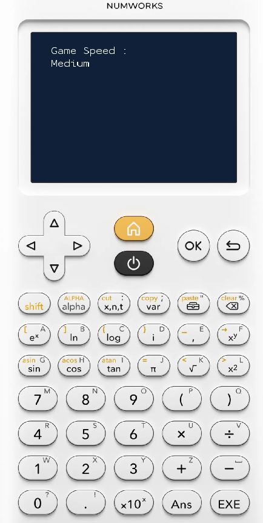
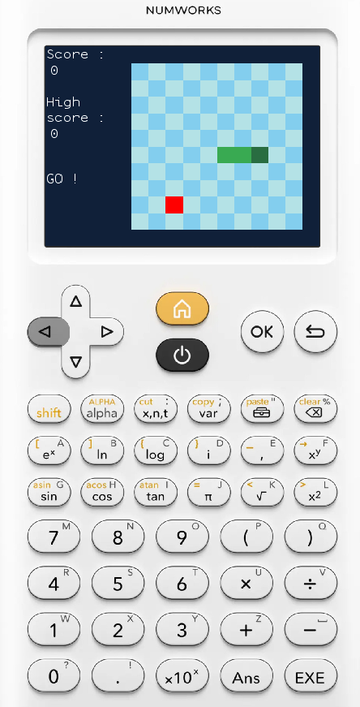

# Snake

A Snake implementation using Rust and NumworksAppsRust template.

## Description

A simple Snake game.
The game saves the best score between sessions.
There are 5 game speeds that you can select when the game starts.

## Controls

- Up arrow or 8: Up
- Down arrow or 2: Down
- Left arrow or 4: Left
- Right arrow or 6: Right

## Installation

This application is designed to run on a **NumWorks** calculator.

### From a release:

1. Download the latest release from [Releases](https://github.com/Nathan-44/Snake_numworks/releases/).
2. Connect your NumWorks calculator to your PC.
3. Go to the NumWorks website and log in [NumWorks](https://www.numworks.com/fr/)
4. Go to [NumWorks apps](https://my.numworks.com/apps) and follow instructions.
5. Find the app on your calculator and play.

#### IF THE CALCULATOR CRASHES WHEN YOU REINSTALL THE APP, YOU MUST RESET THE CALCULATOR AND THEN REINSTALL THE APP

### From source:

#### Prerequisites:

- Rust (and Cargo, ...)
- Git
- Linux

Clone the project:

```bash
git clone https://github.com/Nathan-44/Snake_numworks.git
cd Snake_numworks
```

Start Docker: `./docker.sh start`

On Debian-based distribution : `bash ./setup.sh`.
<br>
On other linux distribution : More information [here](https://github.com/yannis300307/NumworksAppsRust/).

## Screenshots





## Development

This project uses **Rust** and the **NumworksAppsRust** template.


## License

The code specific to this application is distributed under the **MIT** license.

Code derived from the NumworksAppsRust template remains subject to its original license.

See the [LICENSE](LICENSE) file for more information.

## Credits

* [NumworksAppsRust](https://github.com/yannis300307/NumworksAppsRust/) — template used to develop the game.
* [NumWorks](https://www.numworks.com/) — target platform.
